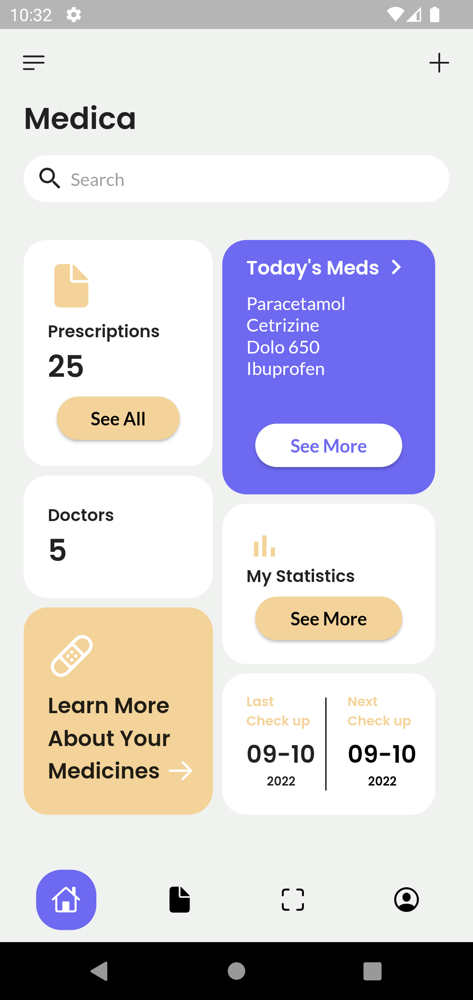
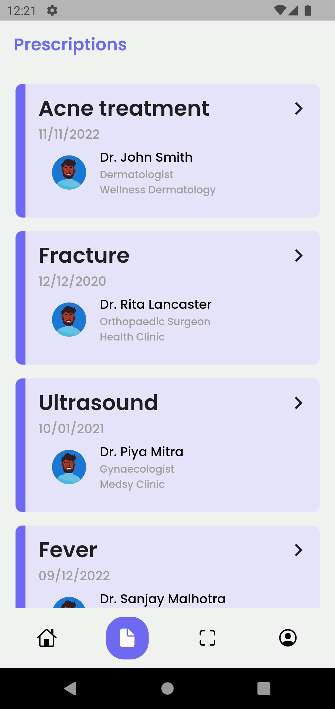
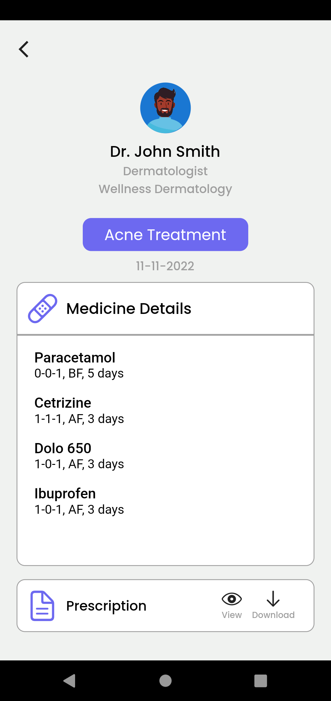
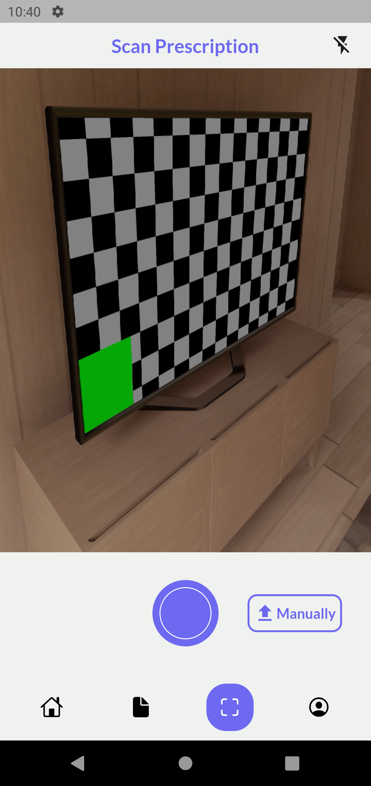
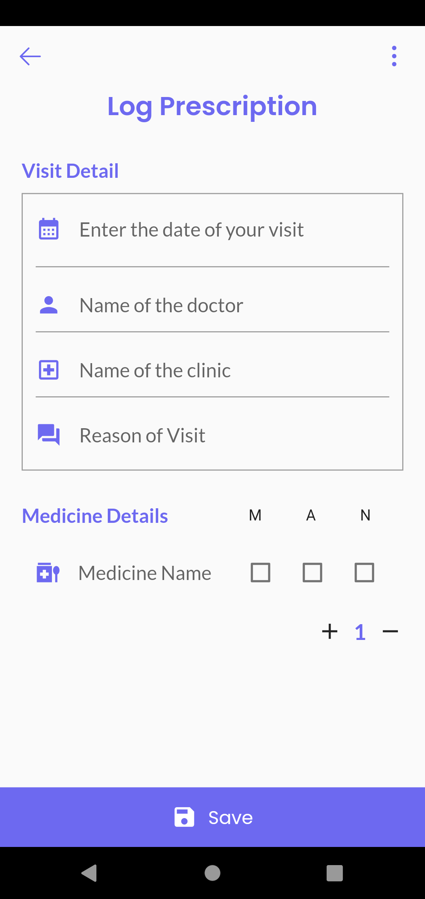
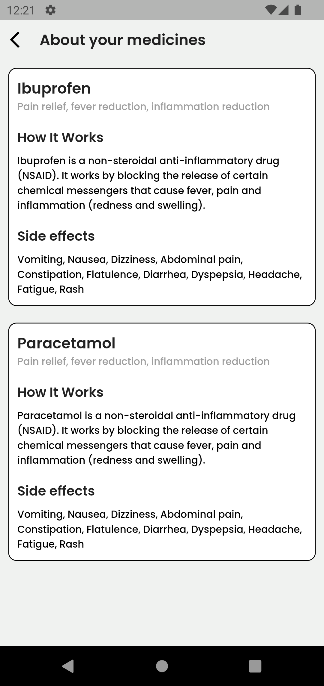
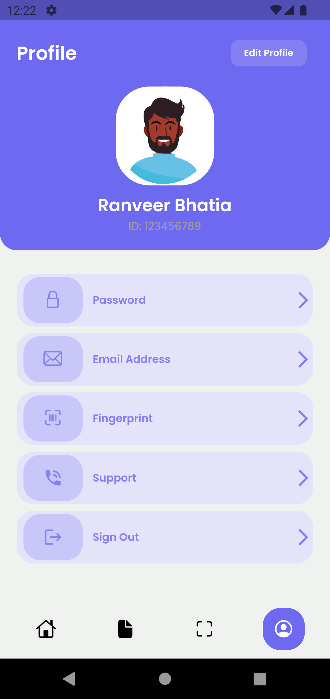
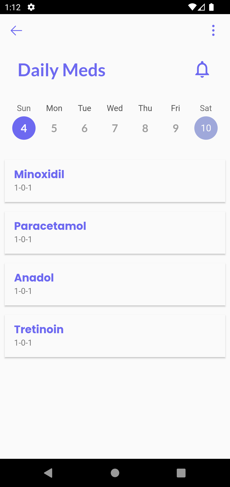
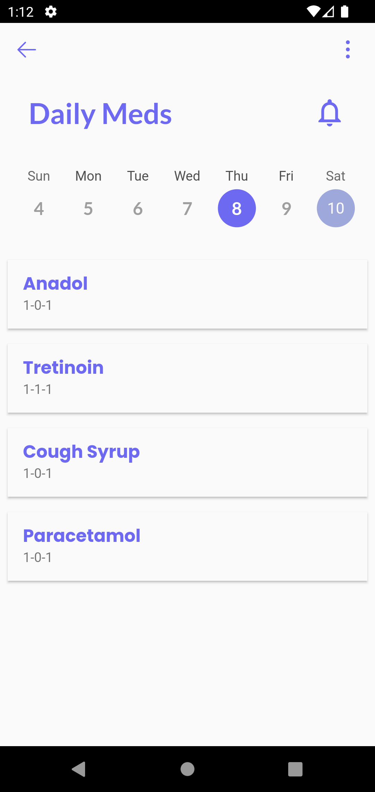
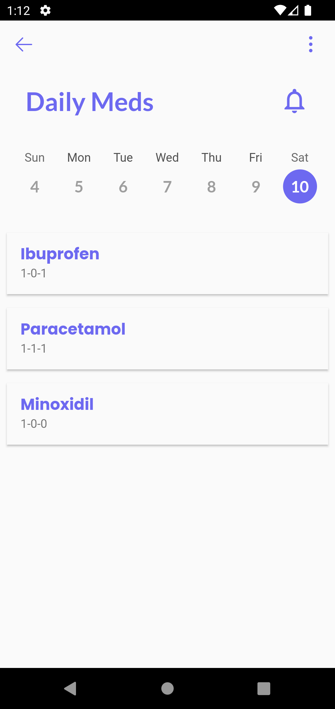

# Medica

### About 

A prescription scanning app which also has features of medicine logging.

Medica will allow users to scan their prescription which will generate the data present and will be stored in the app. The users will always have their doctor's prescription at all times in the app, which will be helpful in case of misplacement of prescription or if user forgets to carry the prescription with them.

## Screenshots

| HomePage                                  | Prescriptions                                  | PrescriptionDetails                 |         
|:-----------------------------------------:|:----------------------------------------------:| :----------------------------------:|
| | |  |

| ScanScreen                                 | AddDataManually                                   |
|:--------------------------------------:|:-----------------------------------------:|
|  |  |

| LearnMore                                | Profile                                  |
|:--------------------------------------:|:-----------------------------------------:|
|  |  |

| DailyMeds1                                 | DailyMeds2                                   | DailyMeds3                               |
|:--------------------------------------------:|:------------------------------------------:| :-----------------------------------------:|
|    |       |  |

## Disclaimer

All the users data are stored only locally and no information is shared across the internet. 
